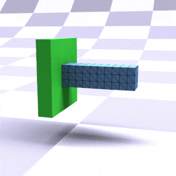
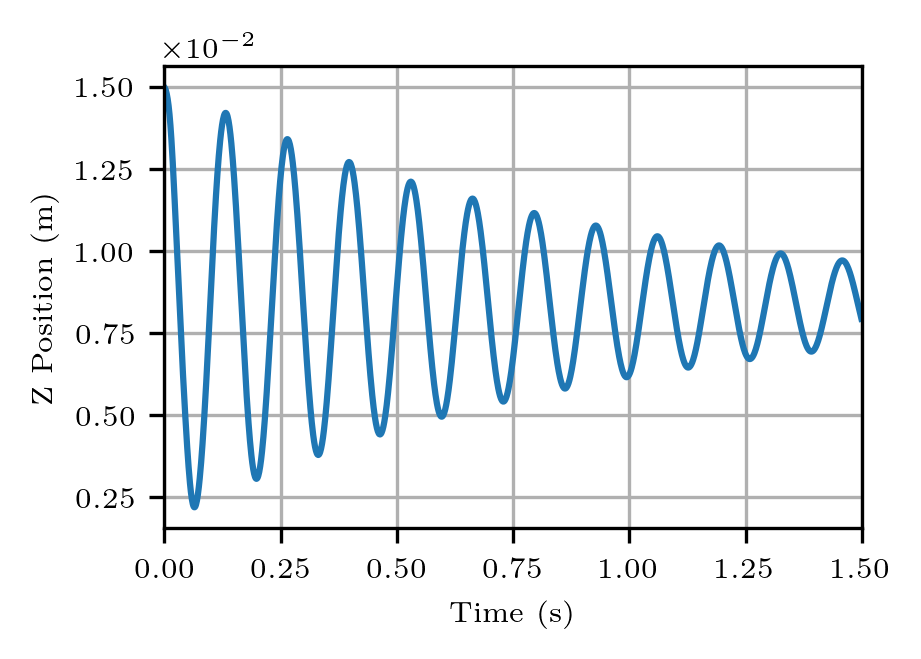
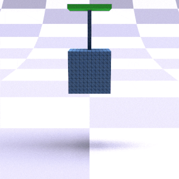
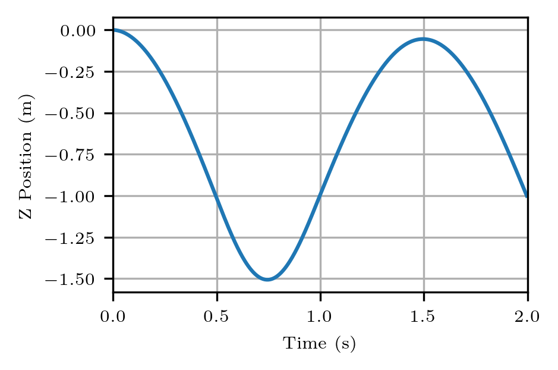
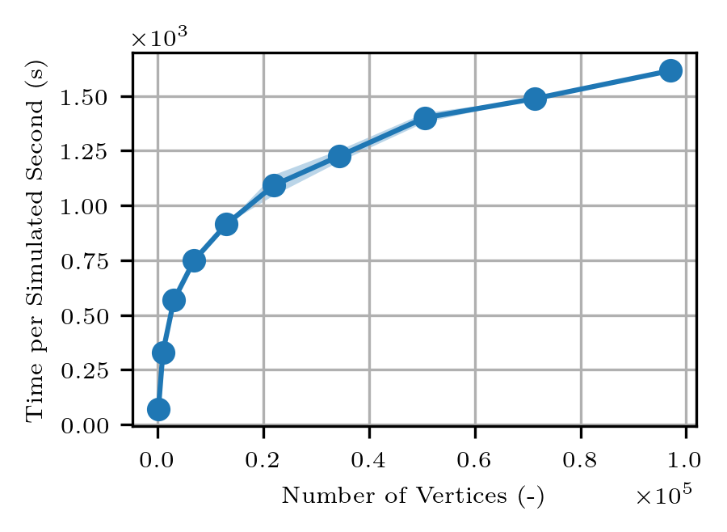
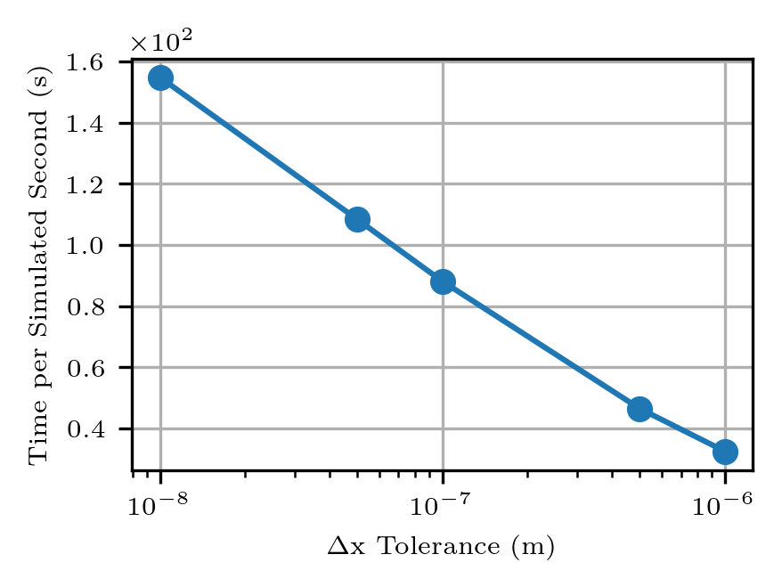
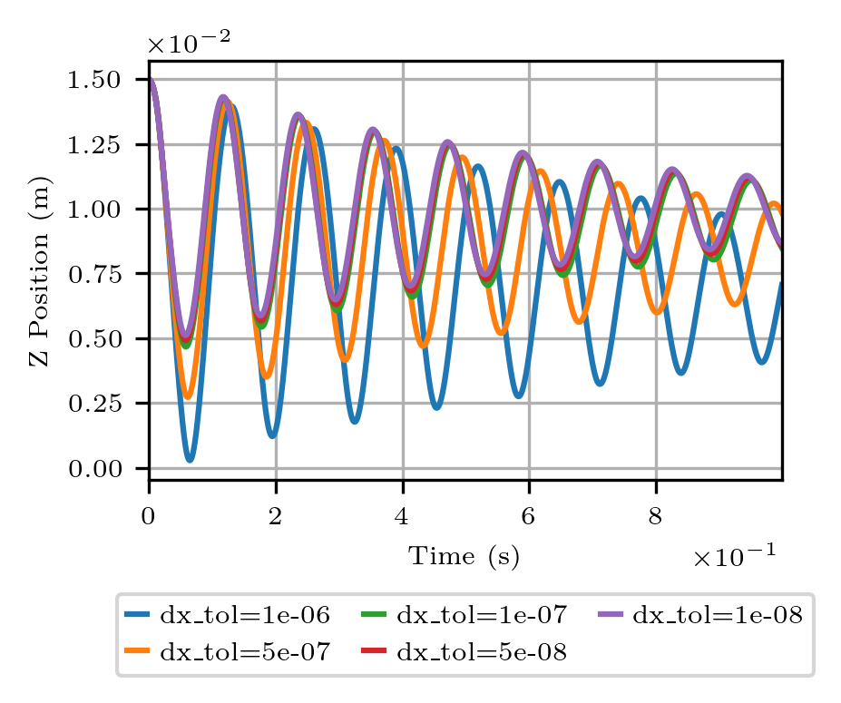
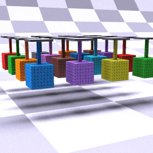
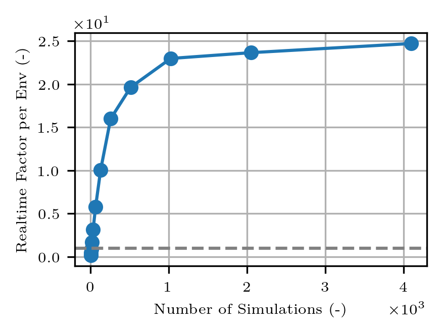

# WarpVBD

Implementing VBD in NVIDIA Warp. Tetrahedral meshes supported with both St. Venant and Stable Neo-hookean material models. Original [Vertex Block Descent paper](https://dl.acm.org/doi/10.1145/3658179) by Chen et al. 2024.


## Installation

Just PBRT-v3 needs to be built for visualization purposes. Run `./install.sh` for this build with CMake.

For the Python packaging only `warp-lang`, `numpy`, and `matplotlib` are required. We have a simple conda environment provided:
```
conda env create -f environment.yml
conda activate warp_vbd
```

## Demos

We present several examples that show the usecases of the simulator. The first time the VBD solver is compiled, it can take about 20s. Please be patient when running the code.

### Cantilever

A classical example for soft body simulation is a beam, fixed on one side, falling under gravity. We show the displacement of the free tip face of the beam on the right. This example can be reproduced by running:
```
python examples/run_cantilever.py --render
```

[](asset/imgs/cantilever.mp4)



### Mass Spring System

Another standard soft body system is a mass falling under gravity attached through a thin string spring. We approximate the whole structure with voxels, which are converted to tetrahedral elements, where the mass' edges are by default 11 voxels and the spring is 1 voxel. The top of the spring is fixed in space. We show the displacement of the free bottom face of the mass on the right. This example can be reproduced by running:
```
python examples/run_mass_spring.py --render
```


[](asset/imgs/mass_spring.mp4)



## Benchmarks

We also showcase how the implementation runtime scales with tolerance as well as vertex count. We test the cantilever demo on an RTX 4090. The runtime is how long a simulated second takes to compute. 

### Runtime

Here we vary the number of vertices that are used for the cantilever mesh. Since we use a voxel mesh that is tetrahedralized, we can vary the number of voxels on each edge.
```
python examples/benchmark_vbd_solve.py
```
We do 100 timesteps of 1ms, sampled 3 times for mean and standard deviation in the runtime plot (standard deviation is too small to be visible), but multiply this by 10 for how long a simulated second would have taken.

<p align="left">
    
</p>

This near-linear scaling towards the larger vertices indicates proper parallelization on the GPU, where the number of color groups (7 in this case) remains constant for all vertex counts. At smaller number of vertices the Python overhead is too large, and the Nvidia Warp acceleration is not clear yet.


### Tolerance

We vary the position update tolerance that is allowed for the VBD solver to be considered converged. When the position update norm during iterations fall below this tolerance, the solver returns the solution. Maximum iterations of the VBD solver is set high enough such that we can always reach the tolerance. This example can be run with:
```
python examples/benchmark_tolerance.py
```
We do 1000 timesteps of 1ms, sampled 3 times for mean and standard deviation in the runtime plot (standard deviation is too small to be visible).

<p align="left">
    
    
</p>

The tolerance plays quite a crucial role depending on the application, here 1e-7 is a good balance between accuracy and speed, but this should be checked per simulation.


### Parallelization of Mass Spring

We test the ability of parallel environments to achieve real-time performance for soft body simulations. We build upon the mass spring system from our demos, but put these in a parallel setting where multiple mass spring systems are simulated at the same time. This does not increase the number of color groups, hence heavily leverages the parallelization benefits of VBD.

Our parallel simulation environment can be run with an arbitrary number of environments with 
```
python examples/run_mass_spring_parallel.py --render --nsim 16
```
We benchmarked the runtime per environment, and how parallelization can speed this up, and see that faster than realtime performance is possible when the number of simulations is roughly larger than 16. These results can be reproduced with
```
python examples/benchmark_vbd_parallel.py
```




